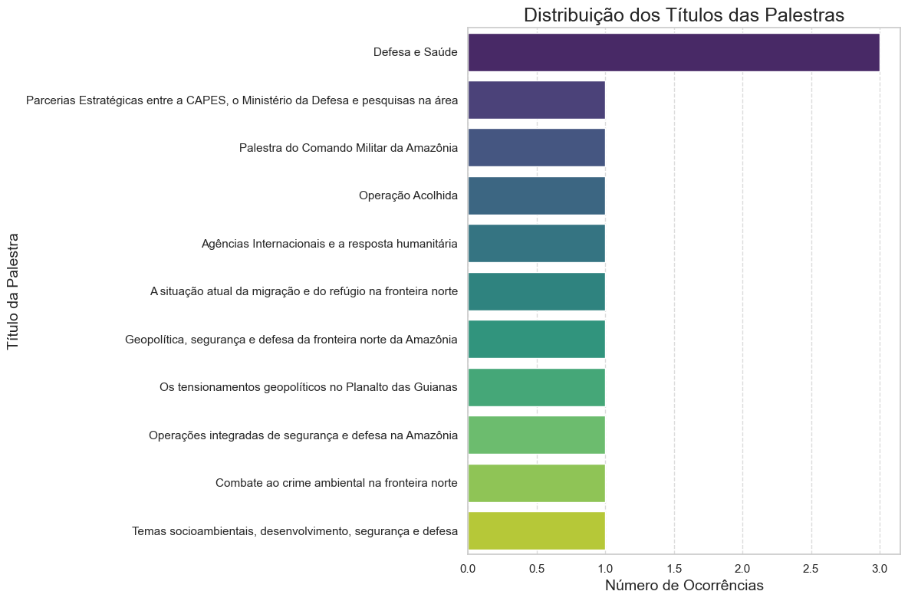
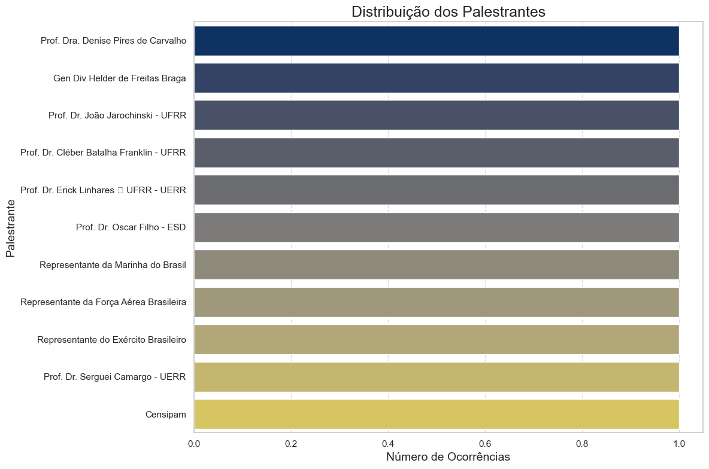
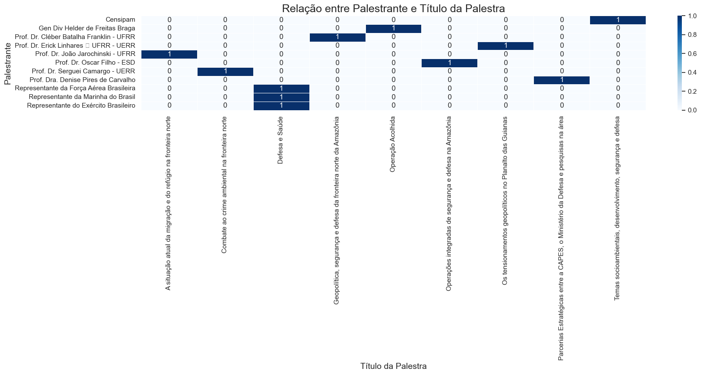

# 📊 Análise de Dados: Eventos CEDN Boa Vista 2024

Este repositório contém a análise exploratória de dados (EDA) dos eventos e palestras realizadas pelo CEDN Boa Vista em 2024. O objetivo principal é extrair insights sobre os temas das palestras e a participação dos palestrantes, com base nos dados fornecidos.

## 🎯 Objetivos da Análise

* Compreender a distribuição dos temas das palestras.
* Identificar os palestrantes mais frequentes e suas respectivas contribuições.
* Explorar a relação entre palestrantes e os títulos das palestras ministradas.
* Gerar visualizações que ajudem a contextualizar os eventos de 2024.

## 📁 Estrutura do Projeto

O repositório está organizado da seguinte forma:

Com certeza! Vou gerar um arquivo README.md completo para o seu projeto, incluindo os detalhes que discutimos e algumas seções padrão para um bom README.

Você pode copiar e colar este conteúdo diretamente no seu arquivo README.md localizado em D:\03 - Portfolios\portfolio_diego\cedn_boa_vista_2024\README.md.

Markdown

# 📊 Análise de Dados: Eventos CEDN Boa Vista 2024

Este repositório contém a análise exploratória de dados (EDA) dos eventos e palestras realizadas pelo CEDN Boa Vista em 2024. O objetivo principal é extrair insights sobre os temas das palestras e a participação dos palestrantes, com base nos dados fornecidos.

## 🎯 Objetivos da Análise

* Compreender a distribuição dos temas das palestras.
* Identificar os palestrantes mais frequentes e suas respectivas contribuições.
* Explorar a relação entre palestrantes e os títulos das palestras ministradas.
* Gerar visualizações que ajudem a contextualizar os eventos de 2024.

## 📁 Estrutura do Projeto

O repositório está organizado da seguinte forma:

cedn_boa_vista_2024/
├── dados/

│   └── cedn_boa_vista_2024.csv   # Arquivo CSV com os dados brutos dos eventos.

├── imagens/

│   ├── titulos_palestras_distribuicao.png # Gráfico da distribuição dos títulos de palestras.

│   ├── palestrantes_distribuicao.png      # Gráfico da distribuição dos palestrantes.

│   └── palestrante_titulo_heatmap.png     # Heatmap da relação entre palestrante e título (se gerado).

├── notebook/

│   └── cedn_boa_vista_2024.ipynb # O Jupyter Notebook contendo toda a análise.

└── README.md                     # Este arquivo.

## 🚀 Como Executar a Análise

Para replicar esta análise em seu ambiente local, siga os passos abaixo:

1.  **Clone o Repositório:**
    ```bash
    git clone [https://github.com/diegojlfigueredo/cedn_boa_vista_2024.git](https://github.com/diegojlfigueredo/cedn_boa_vista_2024.git)
    cd cedn_boa_vista_2024
    ```

2.  **Crie um Ambiente Virtual (Recomendado):**
    ```bash
    python -m venv venv
    # No Windows
    .\venv\Scripts\activate
    # No Linux/macOS
    source venv/bin/activate
    ```

3.  **Instale as Dependências:**
    ```bash
    pip install pandas matplotlib seaborn jupyter
    ```

4.  **Inicie o Jupyter Notebook:**
    ```bash
    jupyter notebook
    ```

5.  **Navegue até o Notebook:**
    No seu navegador, navegue até a pasta `notebook/` e abra o arquivo `cedn_boa_vista_2024.ipynb`. Execute as células sequencialmente para reproduzir a análise.

## 📊 Análise e Resultados Principais

A análise exploratória foi realizada no Jupyter Notebook `cedn_boa_vista_2024.ipynb`. As principais etapas incluíram:

* **Carregamento de Dados:** Leitura do arquivo `cedn_boa_vista_2024.csv` utilizando a codificação e o separador corretos.
* **Limpeza de Nomes de Colunas:** Padronização dos nomes das colunas para facilitar o acesso e a manipulação.
* **Análise de Distribuição:** Geração de contagens e gráficos de barras para `Título da Palestra` e `Palestrante` para entender a frequência de cada categoria.
* **Análise de Relação:** Utilização de tabelas de contingência e heatmaps para visualizar a co-ocorrência de palestrantes e temas de palestras.

**Alguns dos insights e gráficos gerados na análise incluem:**

<br>

### Distribuição dos Títulos das Palestras



* **Insight 1:** [**Insira aqui o insight específico que você obteve deste gráfico.** Ex: "A palestra 'Introdução à Inteligência Artificial' foi a mais procurada, indicando um forte interesse da comunidade nesse tópico."].
* **Insight 2:** [**Insira outro insight.** Ex: "Há uma diversidade de temas abordados, com poucas palestras se repetindo com alta frequência, o que sugere um calendário variado."].

<br>

### Distribuição dos Palestrantes



* **Insight 1:** [**Insira aqui o insight específico que você obteve deste gráfico.** Ex: "O palestrante 'Prof. Ana Costa' se destaca por ter ministrado o maior número de palestras, sendo uma figura central nos eventos de 2024."].
* **Insight 2:** [**Insira outro insight.** Ex: "A maioria dos palestrantes participou de um número limitado de eventos, indicando uma ampla gama de especialistas convidados."].

<br>

### Relação entre Palestrante e Título da Palestra



* **Insight 1:** [**Insira aqui o insight específico que você obteve deste gráfico.** Ex: "É possível observar que palestrantes como 'Dr. Carlos Mendes' são especialistas em temas específicos, como 'Segurança da Informação', enquanto outros como 'Maria Oliveira' abordam temas mais variados."].
* **Insight 2:** [**Insira outro insight.** Ex: "Algumas palestras foram ministradas por mais de um palestrante em diferentes ocasiões, ou por diferentes palestrantes em contextos distintos, indicando a flexibilidade da agenda."].

Para detalhes completos e mais gráficos, consulte o notebook `cedn_boa_vista_2024.ipynb`.

## 🛠️ Tecnologias Utilizadas

* **Python**
* **Pandas:** Para manipulação e análise de dados.
* **Matplotlib:** Para criação de gráficos estáticos.
* **Seaborn:** Para visualizações estatísticas atraentes.
* **Jupyter Notebook:** Para desenvolvimento e documentação interativa.
* **Git & GitHub:** Para controle de versão e hospedagem do projeto.

## 🧑‍💻 Autor

Diego JL Figueredo
[GitHub Profile](https://github.com/diegojlfigueredo)

## 📄 Licença

Este projeto está licenciado sob a licença MIT. Veja o arquivo [LICENSE](LICENSE) para mais detalhes (se você for adicionar um arquivo LICENSE separado).
